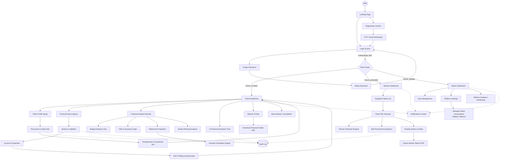

# Application Screen Flow & Navigation Architecture

This document maps the complete application navigation flow and user journeys based on roles and permissions.

## High-Level Screen Flow Diagram

## User Journeys & Navigation Patterns

### 1. Unauthenticated Journey (Public Flow)
- **Entry Point:** Users arrive at the Landing Page.
- **Actions:** They can navigate to Login or Registration.
- **Onboarding:** New users must pass through an OTP and Email verification screen before proceeding to Login. Password recovery routes through a reset token sent via email.

### 2. Client User Journey (`ROLE_CLIENT`)
- **Dashboard:** After login, clients land on the Client Dashboard, which acts as the central hub displaying their financial health score and pending actions.
- **Onboarding/Data Entry:** The flow guides them linearly through Profile Setup (Personal -> Employment) and Data Capture (Assets -> Income -> Risk Profile).
- **Exploration:** Once data is populated, clients can branch out to view specific analysis modules (Budget, FNA, Retirement, Estate).
- **Interactive Tools:** From the Retirement view, users can navigate into the Scenario Simulation Engine. The AI Financial Assistant is accessible directly from the dashboard.
- **Output:** Clients can visit the Reports Center to download their health PDF or proceed to book a consultation.

### 3. Financial Adviser Journey (`ROLE_ADVISER`)
- **Dashboard:** Advisers land on a specialized dashboard featuring key alerts and an overview of their assigned clients.
- **Client Management:** Advisers navigate from the Client List into a specific Client File.
- **Advising Flow:** Inside the Client File, advisers can review the client's analysis, edit financial assumptions specific to that client, and prepare advice.
- **Output:** The flow culminates in the ability to export a comprehensive Adviser Report for the consultation.

### 4. System Administrator Journey (`ROLE_ADMIN`)
- **Dashboard:** Admins access an overview of system health and platform analytics.
- **Management:** Navigation is divided into managing user access and modifying global platform settings (like default inflation and return rates).

### 5. Cross-Cutting Concerns
- **Notifications:** A persistent notification center is accessible from all authenticated dashboards, providing alerts for profile completion, identified financial risks, or new client registrations.
- **Compliance Logging:** Background processes capture changes made in Profile Setup, Data Capture, Assumption Editing, and AI Chats, routing them securely to the Audit Log.